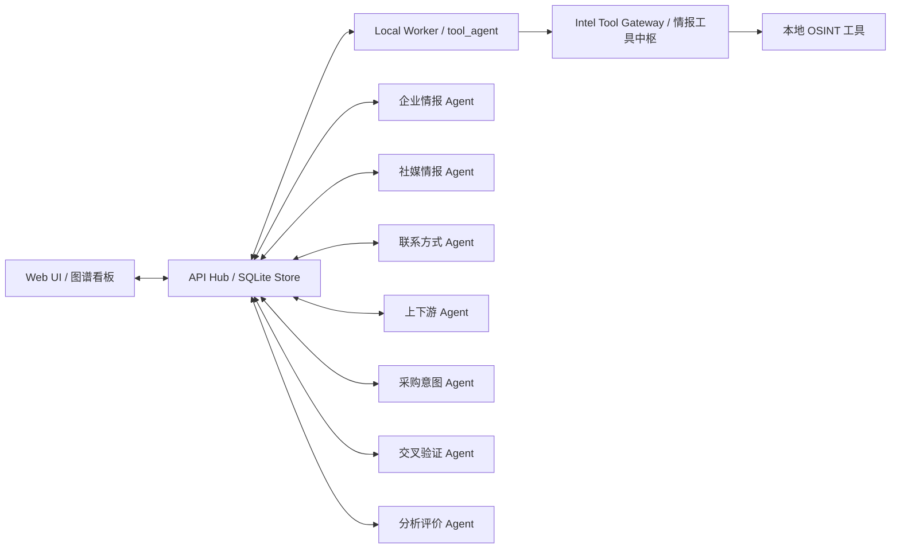
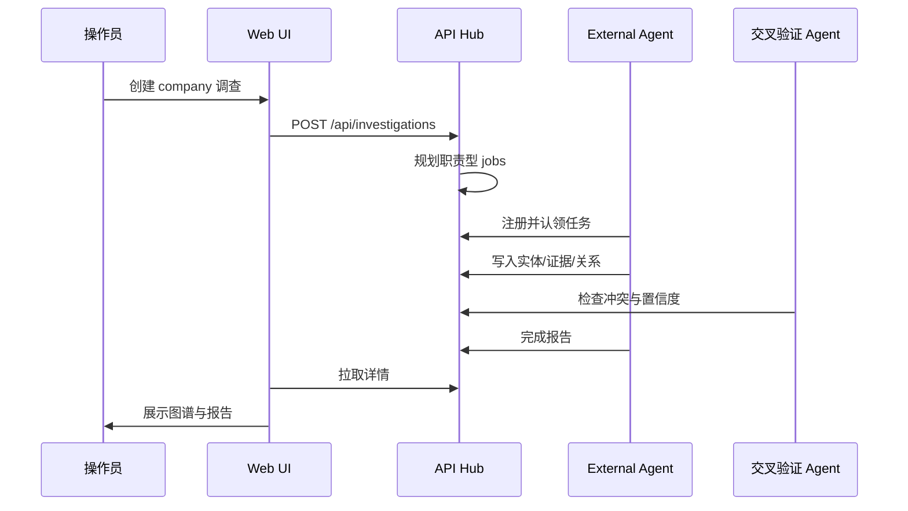

# 多 Agent 编排模型

Version: 0.2
Updated: 2026-05-20

本文定义情报官项目中“多个工具 + 多个 Agent + 统一图谱/报告”的执行模型。目标是让不同 Agent 各自负责一类信息搜索和整理，再由交叉验证与分析评价 Agent 把成熟结论写入任务中心。底层工具不由 Agent 自行盲目选择，而是通过 [情报工具中枢](INTEL_GATEWAY.md) 统一规划路线。

## 1. 总体原则

- 一个调查任务只有一个中心对象，例如企业名称、域名、邮箱、用户名或电话。
- 每个 Agent 只负责自己擅长的信息面，不直接覆盖其他 Agent 的结论。
- 所有结论必须写成实体、证据、关系三类结构，不能只写自然语言报告。
- 任何电话、邮箱、职位、年龄区间、性别、主营业务、上下游关系、采购意图，都必须带来源。
- 公开信息可以进入图谱；敏感、不可验证或越界信息只能进入人工复核备注，不能当作确定事实。

## 2. 分层架构



API Hub 是唯一状态中心。Agent 可以并行执行，但必须通过 API 写回，不直接改前端状态。

## 2.1 工具中枢

Agent 或 Worker 调用底层工具前，应先通过中枢规划路线：

- CLI: `python3 -m app.agent_client plan-tools --target-type domain --target example.com --strategy deep`
- API: `GET /api/tools/plan?target_type=domain&target=example.com&strategy=deep`

中枢会返回 `routes` 和 `skipped_routes`。例如电话只进入 PhoneInfoga，域名不会进入社媒账号工具，邮箱在没有 GHunt Cookie 时自动跳过 GHunt。这样工具数量增加不会直接降低生产质量和稳定性。

## 2.2 约束式检索

Agent 执行搜索前必须先判断“应该依据什么搜”。检索依据来自已确认字段，而不是来自猜测。

标准步骤：

1. 提取强约束：精确姓名、公司名、国家/城市、平台来源、官网、邮箱、电话、采购语境。
2. 组合查询：先用精确字段 + 地区/平台/业务，再逐步放宽。
3. 过滤噪声：同名运动员、音乐人、刑事新闻、娱乐人物等不得自动进入图谱。
4. 写回标准：只有命中主体并带至少一个独立约束，或两个弱来源交叉确认，才写入主图谱。
5. 解释依据：报告中说明为什么该结果属于这个客户，使用了哪些确认字段作为判断依据。

这条规则适用于新闻、社媒、企业目录、联系方式和上下游搜索。

## 2.3 递进式情报推演

系统按“发现 -> 提取 -> 推演 -> 验证 -> 落图谱 -> 预测下一步”的闭环运行。它不是一次性把所有工具跑完，而是根据已经出现的高价值实体继续规划下一步。

递进规则：

- 官网或企业页面出现 `phone`、`email`、`domain` 时，先把联系方式和来源页面写入实体、证据、关系，再分别触发电话、邮箱、域名后续工具。
- 新闻命中不能直接成为企业事实；必须抽取标题、来源、发布时间、URL、文章支持的具体 claim，再由交叉验证判断是否进入主图谱。
- 社媒主页出现简介、位置、外链、照片 URL、兴趣标签时，先标注为公开主页资料，再与企业、职位、邮箱、电话或地区交叉验证。
- 上下游、合作伙伴、采购意图必须能追到触发它的实体和证据，例如官网业务介绍、新闻报道、行业目录、招聘/项目页面。
- 推演出来的下一步 job 使用 `depends_on=inferred_from:<entity_type>:<entity_value>`。这表示“由这条线索触发继续调查”，不是“已经确认”。

示例链路：

```text
company -> official website
official website -> phone/email/contact page
phone -> PhoneInfoga follow-up
email -> socialscan + username/domain follow-up
domain -> theHarvester/Amass follow-up
news -> business_event / buying_signal / risk_signal candidates
cross_verification -> mature graph slot or review note
analysis_judgement -> report + next-step recommendation
```

为了避免无限扩散，递进推演必须遵守 `max_depth`、`max_jobs`、去重键 `tool + target_type + target_value`，并把弱线索优先放入折叠区或待复核。

## 2.4 专业情报循环

所有企业和决策人背调任务按情报循环执行，而不是按零散工具结果拼报告。

| 阶段 | 系统动作 | 写回要求 |
| --- | --- | --- |
| PIR / 需求定义 | 明确本次最重要的问题：企业是否真实、采购价值、决策人身份、联系方式、风险点 | event 或 report 中列出 3-5 条 PIR |
| Collection / 抓取 | 按工具中枢和约束式检索抓取公开来源 | entities、evidence、relationships |
| Collation / 分类清洗 | 去重、按企业/人物/联系方式/新闻/上下游/采购意图归类 | 合并重复实体，噪声进入待复核 |
| Evaluation / 可靠性评估 | 使用 Admiralty Code 标注来源可靠度和信息可信度 | `A-1` 到 `F-6`，写入证据或报告 |
| Corroboration / 交叉确认 | 多来源确认事实链，识别同名噪声和定向误导 | conflicts、source_rank、confidence_adjustments |
| Directed Collection / 定向拓展 | 根据已确认事实规划下一步查询 | `depends_on=inferred_from:...` 的后续 job |
| Synthesis / 融合分析 | 使用 ACH 检查竞争性假设，保留最难被证伪的解释 | 报告中列出假设、支持证据、反证 |
| Production / 交付 | BLUF 结论先行，给概率语言和行动建议 | report_markdown、graph_slots、followup_recommendation |

Admiralty Code 使用两维评价：

- 来源可靠度：`A` 官方/原始来源，`B` 通常可靠来源，`C` 聚合或工具解析来源，`D` 单一弱线索，`E` 明显不可靠，`F` 无法判断。
- 信息可信度：`1` 已被充分证实，`2` 很可能真实，`3` 有可能，`4` 值得怀疑，`5` 很不可能，`6` 无法判断。

概率语言统一使用：`几乎可以肯定`、`很有可能`、`有可能`、`可能性较低`、`很不可能`。最终报告不得写“绝对确定”，除非它只是引用官方注册或官网明示字段。

## 2.5 空白 Alibaba Lead 逆向补全

当 CRM/Alibaba 只给出一个姓名、国家、买家等级和建档时间时，系统不应直接判定为低价值线索，也不应用宽泛姓名乱搜。它必须先进入“弱线索逆向补全”流程。

### 输入锚点

先把截图或 CRM 中的可确认字段写入图谱：

- 买家/账号显示名和变体：例如 `David MurilloSoto`、`David Murillo Soto`。
- CRM 公司名称原始字段：例如字段标签为“公司名称”时，`David Murillo` 必须优先作为企业名、商号或自然人商户名称处理，不能因为文本像人名就直接等同为决策人。
- 国家/地区：例如 `Colombia`。
- 平台和等级：例如 Alibaba buyer、L3。
- 注册/建档/咨询时间，并转换为买家当地工作时间判断。
- 业务上下文：业务员、TM 咨询、名片授权、采购品类、年采购额、备注。

字段标签优先级高于字面直觉。公司字段、姓名字段、账号字段、职位字段、邮箱字段必须先作为不同节点入图。只有当官网、RUES/NIT、企业邮箱、电话、Alibaba 主页、头像或买家回复形成闭环时，才允许把这些节点合并为同一个主体。

### 逆向补全链

```text
CRM截图锚点
  -> 字段标签校验
  -> 公司/商号/RUES/NIT 优先检索
  -> 姓名唯一性消歧
  -> LinkedIn/公开社媒/企业目录候选
  -> 工商/本地目录/RUES/NIT/官网/地图交叉
  -> 电话/邮箱/域名提取
  -> 海关/提单/HS code/进口记录候选
  -> 采购品类与我方产品匹配
  -> ACH + I&W + BLUF
```

所有候选必须区分两类置信度：

- `record_confidence`: 这条公开记录本身是否真实。
- `identity_match_confidence`: 它是否属于截图中的买家。

例如企业目录能强确认 DR&MR 是一家真实公司，但不能自动强确认 David MurilloSoto 就是该公司的某个人。

如果发现上一轮把公司字段误当成人名，Verify Agent 必须新增 `field_interpretation_correction` 事件，下调相关个人社媒/LinkedIn 链条，把候选重新放回 `NEEDS_REVIEW`，并在报告中明确写出“公开记录真实性”和“与该买家同一性”的区别。

### 硬资产卡位

能显著提高买家价值判断的硬资产证据包括：

- 企业注册、NIT/RUES、官网、真实地址和电话。
- 海关提单、进口记录、HS Code、货柜量、到港记录。
- 招聘、仓库、项目、展会、工程照片、新闻报道。
- 与产品品类直接相关的进口或施工记录。

如果硬资产显示曾进口我方相关品类，例如铝型材 `7604`、钢化玻璃 `7007`、门窗五金、护栏、机械设备，可把采购潜力从“弱信号”升级为“高价值待跟进”。如果没有这些证据，只能保留为潜在买家。

### 意图判定

Alibaba 等级和工作时间询盘是意图征候，不是最终结论：

- L3 / 多次咨询 / 工作时间发起：提高活跃度评分。
- 采购品类为空 / 年采购额为空 / 不给图纸规格：提高不确定性和套价风险。
- 愿意给图纸、数量、目的港、标准、项目时间：提高真实项目概率。

### 红队场景

空白 Lead 至少输出三个剧本：

| 剧本 | 含义 | 关键征候 |
| --- | --- | --- |
| Alpha | 真实 B 端买家，正在比价或替换供应链 | 给图纸、数量、目的港、项目时间、公司身份 |
| Beta | 套报价，用于压现有供应商 | 只问通货价/MOQ，不给项目细节 |
| Gamma | 同名噪声或个人买家 | 找不到公司、联系方式、采购品类交叉 |

系统给业务建议时，应建议透明获取公司名、网站、WhatsApp、图纸、规格、数量、项目地和交付期，不把“话术探针”包装成欺骗或隐蔽动作。

## 3. Agent 职责

| Agent Role | 主要输入 | 主要产出 | 典型来源 |
| --- | --- | --- | --- |
| `enterprise_intel_agent` | 企业名称、域名 | 企业名称、官网、电话、邮箱、地址、主营业务、行业 | 官网、工商/州注册、目录站、新闻、招聘 |
| `social_intel_agent` | 企业名、决策人姓名、用户名 | 社媒主页、简介、位置、关联链接、公开照片线索、兴趣标签 | Maigret、Social Analyzer、Sherlock、搜索结果 |
| `contact_discovery_agent` | 企业名、官网、人员名 | 企业电话、企业邮箱、决策人公开联系方式、联系页 | 官网、页脚、联系页、公开目录、theHarvester |
| `supply_chain_agent` | 企业名、行业、地址 | 上游、下游、合作伙伴、同址企业、客户类型 | 官网、行业目录、进口/招聘/地图/新闻 |
| `purchase_intent_agent` | 主营业务、询盘背景、产品品类 | 采购品类、需求匹配、采购阶段、跟进建议 | 网站内容、历史任务、行业报告、公开岗位 |
| `news_intel_agent` | 企业名、官网、新闻 URL | 企业动态、项目、合作、融资、诉讼、处罚、采购信号 | GNews、Google News RSS、Newspaper4k、公开媒体 |
| `cross_verification_agent` | 全部实体、证据、关系 | 冲突列表、来源等级、重复合并、置信度调整 | 所有来源 |
| `analysis_judgement_agent` | 验证后数据 | 成熟画像、风险摘要、买家评分、报告、图谱槽位建议 | 交叉验证结果 |

## 4. Company 任务默认队列

`company` 类型任务会规划七类职责型 job：

1. `company_osint` -> `enterprise_intel_agent`
2. `social_profile_search` -> `social_intel_agent`
3. `contact_discovery` -> `contact_discovery_agent`
4. `supply_chain_mapping` -> `supply_chain_agent`
5. `purchase_intent_assessment` -> `purchase_intent_agent`
6. `company_news` -> `tool_agent`
7. `company_news_monitoring` -> `news_intel_agent`
8. `cross_verification` -> `cross_verification_agent`
9. `analysis_judgement` -> `analysis_judgement_agent`

`quick` 策略只保留企业基础、联系方式和分析评价；`standard` 保留前五类与分析评价；`deep` 和 `maximum` 保留完整队列。

## 5. 数据写回合同

每个 Agent 至少写回：

- Event: 当前执行到了哪里，失败原因是什么。
- Entity: 发现了什么对象。
- Evidence: 这个对象从哪里来，证据片段是什么。
- Relationship: 对象之间是什么关系。

推荐写回顺序：

```text
event(started)
entity(company/person/contact/profile/location/business_scope)
evidence(source -> entity)
relationship(entity -> entity)
event(summary)
complete(status, summary, report_markdown, confidence)
```

示例：官网电话指向企业。

```json
{
  "entity": {
    "type": "phone",
    "value": "+1...",
    "source_tool": "official_website",
    "confidence": 0.82
  },
  "evidence": {
    "entity_value": "+1...",
    "evidence_kind": "contact_page",
    "source_tool": "official_website",
    "snippet": "Contact page lists the phone number."
  },
  "relationship": {
    "from": "Family Hospitality LLC",
    "to": "+1...",
    "relationship_type": "company_has_phone",
    "confidence": 0.82
  }
}
```

## 6. 证据等级

| 等级 | 来源类型 | 处理方式 |
| --- | --- | --- |
| A | 企业官网、政府/州注册、公开备案、原始社媒主页 | 可作为强证据 |
| B | 权威目录、主流地图、招聘站、行业协会 | 可作为中强证据 |
| C | 搜索结果摘要、聚合站、自动解析页面 | 需要交叉验证 |
| D | 单一弱线索、未经确认文本、推断结果 | 只进入待复核 |

分析评价 Agent 输出结论时必须说明来源等级和置信度。

## 7. 决策人画像边界

决策人画像与企业图谱放在同一个任务中，不作为孤立任务。可整理内容包括：

- 公开姓名、职位、公司角色。
- 公开邮箱、电话、社媒主页。
- 公开性别线索、年龄区间线索。
- 公开活动地区、常驻地区或商业活动区域。
- 公开兴趣爱好、饮食/商务习惯，只能标注为公开偏好线索。
- 与企业、品牌、上下游、采购意图的关系。

不得把无法公开验证的信息写成确定事实。婚育、家庭成员、私人住址等高敏内容即使出现，也应默认进入人工复核，不作为常规图谱槽位展示。

## 8. 成熟结论标准

一条信息进入主图谱前，应满足至少一个条件：

- A 级来源直接支持。
- 两个以上 B/C 来源交叉支持。
- 一个 B/C 来源加一个上下文关系支持，且无冲突证据。

不满足条件的信息可以保留在折叠区或报告“待复核线索”中。

## 9. 执行闭环



## 9.1 成熟信息落图标准

图谱主槽位只显示成熟或高价值的核心信息；多余或弱证据进入折叠区。每条主槽位信息都要有一条可追溯标准线：

```text
来源页面/工具 -> 证据 -> 实体 -> 关系 -> 图谱槽位/报告结论
```

例如电话不是孤立显示，而是：

```text
official_website(contact_page) -> +1... -> company_has_phone -> 企业联系方式槽位
```

决策人画像与企业信息并列存在于同一个任务中。决策人邮箱、电话、职位、社媒、性别线索、年龄区间、活动地区、公开兴趣和商务习惯，只有在公开来源可追溯时才进入主槽位；不确定内容进入折叠区或待复核。

## 9.2 报告交付格式

最终报告必须使用 BLUF 原则：

1. `BLUF`: 第一段直接给核心判断、置信度和最重要的行动含义。
2. `PIR 回答`: 逐条回答本任务优先情报需求。
3. `确认事实`: 只列成熟结论，并标注 Admiralty Code。
4. `竞争性假设 ACH`: 列出至少两个可能解释，说明哪些证据支持或削弱它们。
5. `证据链`: 关键电话、邮箱、官网、社媒、新闻、上下游分别给来源线。
6. `风险和冲突`: 同名噪声、来源冲突、未确认内容。
7. `定向采集计划`: 下一步最值得查的 2-5 个动作。
8. `行动建议`: 给业务跟进、复核、补证或放弃的建议。

## 10. 下一阶段建议

- 为职责型 job 增加独立 claim API，让不同 Agent 可以按 `agent_role` 认领具体 job。
- 把 `depends_on` 从展示字段升级为执行门禁。
- 增加 evidence URL、source rank、review status 字段。
- 保持按需启动、用完退出的运行方式；只在手动执行队列时做失败重试和结果记录。
- 增加报告导出为 PDF/HTML 的稳定模板。
